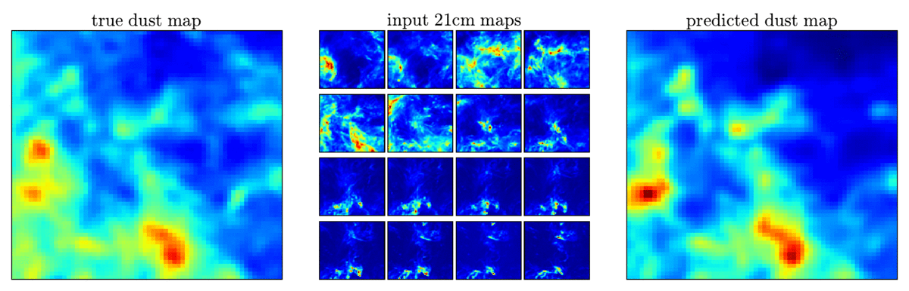

# Predicting CMB dust foreground using galactic 21-cm data with U-Net

## Introduction

The [cosmic microwave background](https://en.wikipedia.org/wiki/Cosmic_microwave_background) (CMB) is one of the most powerful astronomical probes to study the content and evolution of our universe. To extract the cosmological information from the measurement, it is crucial to remove the foreground contamination so that the analysis can be free of bias. The two most important foregrounds of CMB are synchrotron and dust.

In this [project](https://arxiv.org/abs/1904.13265), we adopt a deep neural network approach to predict the microwave dust foreground in our galaxy using the galactic 21-cm data. Since the galactic 21-cm emission traces the neutral hydrogen in our galaxy and various components of the Milky Way (stars, dust, neutral and ionized hydrogen, etc.) trace each other, it is reasonable to expect that the galactic 21-cm data is correlated with the dust foreground.

## Data

For our target dust maps, we use the publicly available all-sky dust map produced by the [Planck Satellite](https://www.esa.int/Our_Activities/Space_Science/Planck) team using component separation. For our 21-cm data we take the full-sky measurements of the 21-cm emission from our galaxy as measured by [HI4PI survey](https://arxiv.org/abs/1610.06175). Since both data sets are measured in spherical coordinates (intensity at different angular positions on the sky), we first use [HEALPix](https://healpix.sourceforge.net) to cut out square images of random centers and rotations with side length of 24.96 degrees and resolution of 64×64 pixels. For the target dust map, there is only one channel; for the 21-cm data, we use 50 velocity slices ranging from -32.25 km/s to 32.25 km/s.

After the data processing, for each set we have the target dust map of shape (64,64,1) and the 21-cm galactic data of shape (64,64,50). All maps in one set have the same cutout and [mask](https://arxiv.org/abs/1801.04945) (to remove bright point sources). We generate 50000 sets of maps from the northern galactic hemisphere for training the neural network and 1000 sets of maps from the southern galactic hemisphere for measuring the performance of the model. To ensure no overlap between the training and test data sets, we do not use projection centers with declination below 17.65 degrees.

## Model

Our neural network structure is based on the [U-Net](https://arxiv.org/abs/1505.04597) model. U-Net is an image-to- image network, which takes images as input and also outputs images. U-Net was designed to perform image segmentation tasks. The task in this project is similar to image segmentation, i.e. both generating pixel-to-pixel maps. Since this model has no fully connected layer, it can fit different input image sizes using the same model.

The above figure shows the U-Net architecture with the 64×64 input images adopted in the paper. The U-Net has a downward part and an upward part. The downward part consists of four sets of double convolution operations (green right arrow) and a maximum pooling (purple down arrow). Each convolution operation contains a convolution layer with a 3×3 kernel, stride 1 and same padding, a batch normalization layer, a rectified linear unit for activation, and a dropout layer with dropout rate of 0.3 to regularize the network. For the maximum pooling, we use a 2×2 kernel and stride 2. The upward part concatenates the current and previous downward part outputs (gray right arrow) and then uses transposed convolution with a 2×2 kernel and stride 2 (yellow up arrow) to recover the original image size. The output of the U-Net is images of 64×64 pixels, so they can be directly compared with the target dust maps. In the figure, for each layer the resulting number of pixels is labeled in left (downward) or right (upward) and the resulting number of channels is labeled in top.

We define the loss function of the neural network to be

Here, T is the target dust map and tilde T is the predicted dust map. There are two terms in the loss function, and γ controls the relative contributions between the two terms. The first term is the mean cross-correlation coefficients at angular scale bins of 15-100 (subscript 50) and 100-200 (subscript 150). The cross-correlation coefficient as a function of angular scale is measured by

where C is the angular power spectrum. A cross-correlation coefficient of 1 corresponds to perfect prediction, while 0 a map that is completely uncorrelated. For scientific interest, we are most interested in recovery of large-scale smooth components which are the scales most relevant for the cosmological measurement. Therefore, by minimizing of the loss function, the correlation between the target and predicted dust maps is maximized.

The second term of the loss function is the mean pixel-by-pixel difference between the target and predicted dust maps. The pixel difference is quantified using the L1 loss so that the model will not be too sensitive to the outliers and bright spots, which occur when the point sources in the dust and 21-cm maps are not masked out. Though our primary goal is to make the predicted maps be as highly correlated with the target maps as possible, i.e. minimization of the first term, we include the pixel difference in the loss function because the cross-correlation coefficient is invariant under a total amplitude rescaling of predicted maps. This helps break the degeneracy of the loss function for the neural network and the training is more stable. We find that the performance (in terms of cross-correlation coefficient) is insensitive to the choice of γ, and we set it to be 30 so that the two terms have similar contributions.

## Result

The above animation shows the results for various cutouts. The left panel is the target dust map, the middle panel displays 16 channels (out of 50) of the 21-cm data, and the right panel is the predicted dust map. We find that although the prediction is not perfect, the neural network still captures most of the features in the target dust maps!

To better examine the performance of the U-Net, we compare it with two simple models. The **integrated intensity model** predicts the dust maps by the sum of the 21-cm data across all channels; the **linear combination model** predicts the dust maps by the weighted sum of the 21-cm data across all channels using the optimal linear weights computed from the training set. The above figure shows the cross-correlation coefficients predicted from the three models on the test set as a function of angular scales. We can clearly see that the U-Net model (blue dot-dashed line) outperforms the other models. While the improvement is modest, this indicates that the neural network indeed learns non-trivial features from the full velocity slices of the 21-cm data, and the transformation cannot be achieved by linear operations!

## Outlook

In this project, we show that the deep neural network can be used to predict the dust intensity maps with 21-cm data of full velocity slices as input. The natural next step is to extend this work to the polarization of the dust maps. This is particulary interesting for future CMB experiments that aim to constrain the presence of tensor modes in the primordial fluctuations. Some stuies have found significant correlation between the dust polarization angle and the [Hough transformed](https://en.wikipedia.org/wiki/Hough_transform) integrated 21-cm intensity. With the aid of neural network, we might be able to better predict polarized dust foregrounds!
